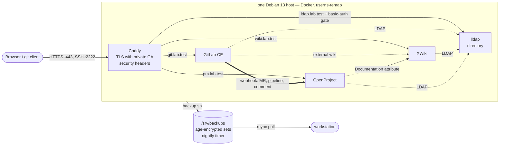

# Test-Projekt — Docker-based team work environment

[](https://github.com/NicolasPogorzelski/Test-Projekt/actions/workflows/lint.yml)
[](https://github.com/NicolasPogorzelski/Test-Projekt/actions/workflows/secret-scan.yml)
[](LICENSE)

A self-hosted work environment for a small team, deployed with Docker Compose on a
single Debian 13 host:

| Role | Product | Hostname |
|---|---|---|
| Source code & CI/CD | GitLab CE | `git.lab.test` |
| Documentation | XWiki | `wiki.lab.test` |
| Project management | OpenProject Community | `pm.lab.test` |
| Identity (shared accounts) | lldap | `ldap.lab.test` |
| Reverse proxy / TLS | Caddy | — |

All services are served over HTTPS with certificates issued by a private CA, share
one LDAP directory for user accounts, and can be backed up and reinstalled with the
scripts in `scripts/`.

This repository was built as a practical assessment task in three days. Every
design decision is recorded as an Architecture Decision Record in
[`docs/adr/`](docs/adr/).

**Proven, not claimed** (2026-09-20): a rebuilt VPS was back to a working system
**21 minutes** after the first root login from one encrypted backup set
([protocol](docs/backup-restore.md#restore-test-protocol)); the security baseline
was measured from outside — port scan, TLS, headers — and with the CIS Docker
Benchmark, **12 → 44 of 117** after three fixes, every remaining finding
classified ([verification](docs/security.md#verification)); 23 problems are
recorded with root cause and fix ([problems](docs/problems.md)).

## At a glance



Solid arrows: user traffic through the proxy. Dotted: shared identity and the
documentation links. Double: the GitLab → OpenProject webhook. Details:
[`docs/architecture.md`](docs/architecture.md), [`docs/integration.md`](docs/integration.md).

## Contents

- [Repository layout](#repository-layout)
- [Quick start](#quick-start)
- [Evaluating this repository](#evaluating-this-repository)
- [Documentation](#documentation)
- [Runbook](#runbook): [workstation](#workstation-setup) · [host](#host-preparation) · [first start](#first-start-of-the-stacks) · [backup and restore](#backup-and-restore) · [certificates](#certificate-renewal-yearly) · [upgrades](#upgrades) · [project onboarding](#project-onboarding) · [users](#on--and-offboarding) · [secrets](#secrets-rotation)
- [Tooling and use of AI assistance](#tooling-and-use-of-ai-assistance)
- [License](#license)

## Repository layout

```
docs/            architecture, security, integration, backup/restore, problems, ADRs
pki/             scripts to create the private CA and issue service certificates; ca.crt
proxy/           Caddy compose stack and Caddyfile
services/        one compose stack per service: gitlab, xwiki, openproject, lldap
scripts/         bootstrap.sh (host preparation), backup.sh, restore.sh
.env.example     all environment variables with placeholders
```

## Quick start

> Full runbook: see below. Prerequisites: a Debian 13 host with a public IP, a
> workstation with `openssl`, `ssh` and `git`.

1. **Workstation:** clone this repository, create the CA and the service
   certificates (`pki/make-ca.sh`, `pki/issue-cert.sh` — see
   [`pki/README.md`](pki/README.md)), add the `*.lab.test` names to
   `/etc/hosts`, import `pki/ca.crt` into your browser and verify its
   fingerprint:
   `SHA256 A7:08:31:80:94:29:B9:64:81:47:C3:83:9F:D3:55:04:AE:37:06:FD:81:9A:0D:AB:A7:9B:3E:3D:38:97:49:B0`
2. **Host:** create the admin user (see "Host preparation" below), clone this
   repository and run `sudo ./scripts/bootstrap.sh` from that account (sshd
   hardening, Docker CE with `userns-remap`, apt pin, sudoers rule, `/srv`,
   Docker networks — see [`scripts/README.md`](scripts/README.md)).
3. Copy `.env.example` to `.env` in each stack directory and fill in secrets.
4. Copy the service certificates to `/srv/proxy/certs/`.
5. Start the stacks in this order: `proxy`, `lldap`, `gitlab`, `openproject`, `xwiki`.
6. Configure LDAP in each service and the integrations (`docs/integration.md`).

## Evaluating this repository

Three ways, from cheapest to most complete:

1. **Read.** The decisions are in [`docs/adr/`](docs/adr/) (one file per
   non-obvious choice, with the alternatives), the problems and their root
   causes in [`docs/problems.md`](docs/problems.md), the security measures
   and what was verified from outside in [`docs/security.md`](docs/security.md),
   and the measured restore test — a rebuilt VPS back to a working system in
   21 minutes — in [`docs/backup-restore.md`](docs/backup-restore.md).
2. **Reproduce on a fresh Debian 13 host** (cloud VPS with 8 vCPU / 16 GB,
   about 0.13 EUR/h at the provider used here): the "Quick start" above.
   `bootstrap.sh` prepares the host in about two minutes; the first start of
   all five stacks including the LDAP set-up takes one to two hours because
   secrets and directory contents are deliberately created by hand, not by
   scripts in the repository.
3. **Run it elsewhere.** The supported target is Debian 13 — physical,
   virtual or cloud. On macOS or Windows, use a Debian 13 VM (Multipass, UTM,
   Hyper-V; 16 GB RAM for the VM) and follow the same path; Docker Desktop is
   out of scope because the design relies on Linux user-namespace remapping
   and numeric bind-mount ownership, which do not carry through the Desktop
   VM. Other Linux distributions: the compose stacks, `backup.sh` and
   `restore.sh` are distribution-independent; only `bootstrap.sh` is the
   Debian implementation of the host requirements listed in
   [`docs/architecture.md`](docs/architecture.md#host-requirements) — porting
   means replacing its package-manager steps (not exercised in the time-box).

## Documentation

- [Architecture](docs/architecture.md) — components, networks, data flows, threat model
- [Security](docs/security.md) — measures, rationale, ISO 27001 mapping
- [Integration](docs/integration.md) — LDAP, GitLab ↔ OpenProject, XWiki ↔ OpenProject
- [Backup & restore](docs/backup-restore.md) — concept and restore test protocol
- [Problems & peculiarities](docs/problems.md)
- [Architecture Decision Records](docs/adr/)

## Runbook

### Workstation setup

Once per clone, so that every commit is scanned before it exists
(`docs/security.md`, "Secrets and data"):

```
brew install gitleaks shellcheck            # or the distribution packages
git config core.hooksPath scripts/git-hooks
git config hooks.sanitizePatterns ~/path/to/sanitize-patterns   # optional, see below
```

`sanitize-patterns` is a private file **outside** the repository with one
extended regex per line (your admin account name, real host names, key file
names). The hook blocks a commit whose added lines match; without the setting
the hook says so and only gitleaks runs. Before making the repository public,
run the same check over the whole tree:
`grep -rniE -f ~/path/to/sanitize-patterns --exclude-dir=.git .` (no output =
clean).

### Host preparation

Prerequisites outside the repository: a Debian 13 (trixie) cloud server and a
provider firewall that allows inbound TCP 22, 80, 443 and 2222 only.

**First login as root** (once, via the provider's root key). Create the admin
account and hand it the SSH key; everything else is done by `bootstrap.sh`.
Use a lower-case username (`docs/problems.md` P-003).

```
adduser --gecos "" <admin>                 # asks for a password: this is the sudo password
usermod -aG sudo <admin>
install -d -m 700 -o <admin> -g <admin> /home/<admin>/.ssh
install -m 600 -o <admin> -g <admin> /root/.ssh/authorized_keys /home/<admin>/.ssh/authorized_keys
exit
```

Log in as `<admin>` (verify that this works before the next step — the script
disables root and password logins), then:

```
sudo apt-get update && sudo apt-get install -y git   # the cloud image ships without git (P-015)
git clone <this repository> ~/Test-Projekt          # read-only deploy key, see docs/security.md
sudo ~/Test-Projekt/scripts/bootstrap.sh
```

The script is idempotent: run it again after any manual change on the host to
make sure the baseline still holds; the self-test at the end must show only
`PASS`. Details: [`scripts/README.md`](scripts/README.md).

### First start of the stacks

In this order, each README has the exact steps: [`proxy/`](proxy/README.md)
(certificates from `pki/`, Caddy) → [`services/lldap/`](services/lldap/README.md)
(directory, groups, service accounts) → [`services/gitlab/`](services/gitlab/README.md)
→ [`services/openproject/`](services/openproject/README.md) →
[`services/xwiki/`](services/xwiki/README.md). LDAP wiring per product:
[`docs/integration.md`](docs/integration.md).

### Backup and restore

`sudo ./scripts/backup.sh` writes one encrypted set to `/srv/backups/`; the
timer installed by `bootstrap.sh` runs it nightly. Pull the sets to the
workstation with `rsync` (the admin is in group `backup`). Reinstall = host
preparation above → `bootstrap.sh` → copy a set and the age identity →
`sudo ./scripts/restore.sh <set>.tar.age <identity>`. Procedure, guards and the
measured restore test: [`docs/backup-restore.md`](docs/backup-restore.md).

### Certificate renewal (yearly)

`pki/README.md`, "Renewal runbook": issue new leaf certificates with
`issue-cert.sh`, copy them to `/srv/proxy/certs`, restart Caddy; for XWiki
rebuild `/srv/xwiki/cacerts` only if the **CA** changed (the leaf does not
matter to the JVM). The certificates are part of every backup set.

### Upgrades

Take a backup, change the image tag in the stack's `compose.yaml`, `docker
compose pull && docker compose up -d`, watch the healthcheck. GitLab: follow
the upgrade path tool (ADR-0004) and never skip required stops; a set can only
be restored onto the tag it was taken with (`restore.sh` enforces this).
PostgreSQL major upgrades: dump-based restore (`docs/backup-restore.md`).

### Project onboarding

For every new project, in this order: create the XWiki page
`Projects/<name>` (any member can, e.g. as the project lead); create the
GitLab project — it inherits the *External wiki* link to the XWiki index,
set the project's own page under *Settings → Integrations → External wiki*
and disable the built-in wiki under *Settings → General → Visibility*; create
the OpenProject project — it inherits the module defaults (GitLab on, Wiki
off), set the `Documentation` attribute on the overview to the XWiki page,
add the `gitlab-integration` user as member with role `GitLab Integration`
and register the webhook in the GitLab project (`docs/integration.md` §2, §3).

### On- and offboarding

Users exist only in lldap; membership in `git_user`, `wiki_user`, `pm_user`
grants access per product. Steps: `services/lldap/README.md`,
"On-/offboarding". Offboarding removes the account in lldap; sessions in the
products expire on their own; GitLab CE additionally blocks a user whose
LDAP entry no longer exists at that user's next sign-in attempt (the periodic
LDAP sync is a Premium feature).

### Secrets rotation

Rotatable at any time: `GITLAB_LDAP_BIND_PASSWORD` and the bind passwords set
in the OpenProject/XWiki admin UIs (change in lldap, then in the consumer),
`LLDAP_JWT_SECRET` (invalidates UI sessions), the `ldap-ui.auth` gate hash,
database passwords (change in `.env` and in the database, restart the stack).
Never rotate: `LLDAP_KEY_SEED` (encrypts stored keys — a new seed breaks the
directory) and `gitlab-secrets.json` (encrypts database columns). Both are
therefore in every backup set, and the set itself is encrypted with `age`.

## Tooling and use of AI assistance

This project was built with the help of an LLM-based coding assistant (Claude Code).
It was used for research (locating and summarising official documentation), for
explaining concepts and commands, for reviewing configuration, and for drafting the
documentation in `docs/`. Configuration files and scripts were typed and reviewed
line by line by the author, following the official documentation and the
assistant's guidance; every line and every decision recorded in the ADRs can be
explained by the author. Documentation drafts were reviewed before each commit.
No credentials or private keys were ever shared with the assistant, and every
commit was made by the author.

## License

MIT — see [`LICENSE`](LICENSE). The third-party products deployed here keep
their own licenses (GitLab CE: MIT Expat; OpenProject CE: GPLv3; XWiki: LGPLv2.1;
lldap: GPLv3; Caddy: Apache-2.0).
